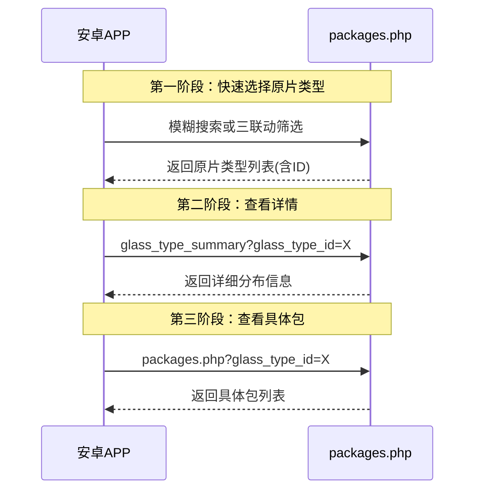

# 📦 原片包信息接口文档

## 📋 接口概述

`packages.php` 提供原片包信息的查询功能，采用分层架构设计：基础查询、快速选择、详情分析。

**文件路径**: `/api/packages.php`  
**认证方式**: Bearer Token  
**支持方法**: GET

## 🏗️ 功能架构

### 1. 基础查询层
- **用途**: 日常库存查看，保持向后兼容性
- **特点**: 支持常规筛选和分页

### 2. 快速选择层  
- **用途**: 快速定位目标原片类型，用于选择器功能
- **特点**: 轻量级返回，突出选择信息

### 3. 详情分析层
- **用途**: 查看某种原片的完整库存情况和分布详情  
- **特点**: 详细统计分析和库位分布

## 🚀 接口功能

### 1. GET /api/packages.php - 基础查询方法

获取原片包信息列表，支持包号模糊查询、原片类型筛选、货架位置查询等多种条件。日常库存查看的主要接口，保持向后兼容性。

#### 请求参数

**请求头**:
```http
Authorization: Bearer your-token-here
```

**查询参数**:

| 参数名 | 类型 | 必填 | 描述 | 示例 |
|--------|------|------|------|------|
| package_code | string | 否 | 包编号模糊查询 | "YP2024" |
| glass_type_id | int | 否 | 原片类型ID精确查询 | 1 |
| rack_id | int | 否 | 货架ID精确查询 | 5 |
| base_id | int | 否 | 基地ID精确查询 | 2 |
| status | string | 否 | 状态查询 | "in_storage" |
| page | int | 否 | 页码，默认1 | 1 |
| page_size | int | 否 | 每页数量，默认20，最大100 | 20 |

**状态可选值**:
- `in_storage`: 库存中
- `in_processing`: 加工中  
- `scrapped`: 已报废
- `used_up`: 已用完

**请求示例**:
```http
GET /api/packages.php?package_code=YP2024&page=1&page_size=20
```

```http
GET /api/packages.php?rack_id=5&status=in_storage
```

```http
GET /api/packages.php?base_id=2&page=1&page_size=50
```

#### 响应示例

**成功响应 (200)**:
```json
{
    "code": 200,
    "message": "获取成功",
    "timestamp": 1698765432,
    "data": {
        "packages": [
            {
                "id": 1,
                "package_code": "YP20240001",
                "dimensions": {
                    "width": 1200.0,
                    "height": 2400.0
                },
                "quantity": {
                    "pieces": 100,
                    "quantity": 1000
                },
                "entry_date": "2024-01-15",
                "position_order": 1,
                "glass_type": {
                    "id": 1,
                    "custom_id": "GT001",
                    "name": "浮法玻璃",
                    "short_name": "浮法",
                    "brand": "信义",
                    "manufacturer": "信义玻璃",
                    "color": "透明",
                    "thickness": 5.0,
                    "silver_layers": "单层",
                    "substrate": "普通",
                    "transmittance": "85%"
                },
                "rack_info": {
                    "id": 1,
                    "code": "R001",
                    "name": "A区货架",
                    "area_type": "storage",
                    "base_id": 1,
                    "base_name": "总部基地"
                },
                "status": "in_storage",
                "status_name": "库存中",
                "created_at": "2024-01-15 10:00:00",
                "updated_at": "2024-01-15 10:00:00"
            }
        ],
        "pagination": {
            "page": 1,
            "page_size": 20,
            "total": 150,
            "total_pages": 8
        }
    }
}
```

### 2. GET /api/packages.php?action=fuzzy_search - 模糊搜索选择器

快速搜索原片类型，用于选择器功能。返回轻量级格式，突出选择信息，便于安卓APP构建搜索界面。支持按多个字段搜索，包括名称、自定义编号、品牌、生产厂家等。

#### 请求参数

**查询参数**:

| 参数名 | 类型 | 必填 | 描述 | 示例 |
|--------|------|------|------|------|
| action | string | 是 | 固定值：fuzzy_search | fuzzy_search |
| keyword | string | 是 | 搜索关键词，长度至少1个字符 | "浮法" |
| fields | string | 否 | 搜索字段，逗号分隔 | "name,brand" |
| page | int | 否 | 页码，默认1 | 1 |
| page_size | int | 否 | 每页数量，默认10，最大50 | 10 |

**搜索字段可选值**:
- `name`: 原片名称 (默认)
- `custom_id`: 自定义编号 (默认)
- `brand`: 品牌 (默认)
- `manufacturer`: 生产厂家 (默认)
- `short_name`: 简称
- `color`: 颜色
- `substrate`: 基材
- `silver_layers`: 银层
- `transmittance`: 透光性

**请求示例**:
```http
GET /api/packages.php?action=fuzzy_search&keyword=浮法&page=1&page_size=10
```

```http
GET /api/packages.php?action=fuzzy_search&keyword=信义&fields=brand,manufacturer
```

#### 响应示例

**成功响应 (200)**:
```json
{
    "code": 200,
    "message": "搜索成功",
    "timestamp": 1698765432,
    "data": {
        "search_info": {
            "keyword": "浮法",
            "search_fields": ["name", "custom_id", "brand", "manufacturer"]
        },
        "selection_options": [
            {
                "id": 1,
                "custom_id": "GT001",
                "name": "浮法玻璃",
                "short_name": "浮法",
                "display_name": "浮法玻璃 (GT001)",
                "brand": "信义",
                "manufacturer": "信义玻璃",
                "color": "透明",
                "thickness": 5.0,
                "has_inventory": true,
                "total_packages": 15
            }
        ],
        "selection_summary": {
            "total_options": 5,
            "brand_count": 2,
            "with_inventory": 3
        },
        "pagination": {
            "page": 1,
            "page_size": 10,
            "total": 5,
            "total_pages": 1
        }
    }
}
```

### 3. GET /api/packages.php?action=get_dropdown_options - 三联动级联选择器

提供厚度、颜色、品牌的三级联动筛选，用于逐步缩小原片类型选择范围。返回级联筛选状态和下一步提示，支持基地权限过滤，只显示有库存的原片类型。

#### 请求参数

**查询参数**:

| 参数名 | 类型 | 必填 | 描述 | 示例 |
|--------|------|------|------|------|
| action | string | 是 | 固定值：get_dropdown_options | get_dropdown_options |
| thickness | float | 否 | 厚度(mm) | 5.0 |
| color | string | 否 | 颜色 | "透明" |
| brand | string | 否 | 品牌 | "信义" |

**请求示例**:
```http
GET /api/packages.php?action=get_dropdown_options
```

```http
GET /api/packages.php?action=get_dropdown_options&thickness=5.0
```

```http
GET /api/packages.php?action=get_dropdown_options&thickness=5.0&color=透明&brand=信义
```

#### 响应示例

**部分筛选响应**:
```json
{
    "code": 200,
    "message": "级联选项获取成功",
    "timestamp": 1698765432,
    "data": {
        "filter_status": {
            "current_filters": {
                "thickness": 5.0,
                "color": null,
                "brand": null
            },
            "filter_progress": {
                "thickness_selected": true,
                "color_selected": false,
                "brand_selected": false,
                "selection_complete": false
            },
            "match_count": 25
        },
        "available_options": {
            "thicknesses": [
                {"value": 3.0, "label": "3mm"},
                {"value": 5.0, "label": "5mm"},
                {"value": 6.0, "label": "6mm"}
            ],
            "colors": [
                {"value": "透明", "label": "透明"},
                {"value": "白色", "label": "白色"}
            ],
            "brands": [
                {"value": "信义", "label": "信义"},
                {"value": "南玻", "label": "南玻"}
            ]
        },
        "glass_types": [],
        "next_step": {
            "action": "continue_filter",
            "message": "请继续选择筛选条件"
        }
    }
}
```

**完整筛选响应**:
```json
{
    "code": 200,
    "message": "级联选项获取成功",
    "timestamp": 1698765432,
    "data": {
        "filter_status": {
            "current_filters": {
                "thickness": 5.0,
                "color": "透明",
                "brand": "信义"
            },
            "filter_progress": {
                "thickness_selected": true,
                "color_selected": true,
                "brand_selected": true,
                "selection_complete": true
            },
            "match_count": 3
        },
        "available_options": {
            "thicknesses": [{"value": 5.0, "label": "5mm"}],
            "colors": [{"value": "透明", "label": "透明"}],
            "brands": [{"value": "信义", "label": "信义"}]
        },
        "glass_types": [
            {
                "id": 1,
                "custom_id": "GT001",
                "name": "5mm透明浮法玻璃",
                "short_name": "5透明浮法",
                "display_name": "5mm透明浮法玻璃 (GT001)"
            }
        ],
        "next_step": {
            "action": "select_glass_type",
            "message": "筛选完成，请选择具体的原片类型"
        }
    }
}
```

### 4. GET /api/packages.php?action=glass_type_summary - 详情分析方法

根据选中的原片类型ID，获取详细库存统计和库位分布信息。分析层的主要接口，提供完整的数据洞察，支持基地权限过滤，返回按基地分组的库位分布详情。

#### 请求参数

**查询参数**:

| 参数名 | 类型 | 必填 | 描述 | 示例 |
|--------|------|------|------|------|
| action | string | 是 | 固定值：glass_type_summary | glass_type_summary |
| glass_type_id | int | 是 | 原片类型ID | 1 |

**请求示例**:
```http
GET /api/packages.php?action=glass_type_summary&glass_type_id=1
```

#### 响应示例

**成功响应 (200)**:
```json
{
    "code": 200,
    "message": "获取原片类型信息成功",
    "timestamp": 1698765432,
    "data": {
        "glass_type": {
            "id": 1,
            "custom_id": "GT001",
            "name": "浮法玻璃",
            "short_name": "浮法",
            "attributes": {
                "brand": "信义",
                "manufacturer": "信义玻璃",
                "color": "透明",
                "thickness": 5.0,
                "silver_layers": "单层",
                "substrate": "普通",
                "transmittance": "85%"
            },
            "created_at": "2024-01-15 10:00:00",
            "updated_at": "2024-01-15 10:00:00"
        },
        "inventory_summary": {
            "total_packages": 15,
            "total_pieces": 1500,
            "total_quantity": 15000,
            "avg_pieces_per_package": 100.0,
            "total_racks_used": 3,
            "bases_involved": 2,
            "total_base_packages": 15
        },
        "base_distribution": [
            {
                "base_id": 1,
                "base_name": "总部基地",
                "racks": [
                    {
                        "rack_id": 1,
                        "rack_code": "R001",
                        "rack_name": "A区货架",
                        "area_type": "storage",
                        "package_count": 10,
                        "total_pieces": 1000,
                        "total_quantity": 10000
                    }
                ],
                "total_packages": 10,
                "total_pieces": 1000,
                "total_quantity": 10000
            }
        ]
    }
}
```

**未找到原片类型 (404)**:
```json
{
    "code": 404,
    "message": "未找到匹配的原片类型",
    "timestamp": 1698765432
}
```

## 📊 数据结构

### Package 对象

| 字段名 | 类型 | 描述 | 示例 |
|--------|------|------|------|
| id | int | 包的唯一标识符 | 1 |
| package_code | string | 包编号，唯一标识 | "YP20240001" |
| dimensions | object | 尺寸信息 | - |
| ↳ width | float | 宽度(mm) | 1200.0 |
| ↳ height | float | 高度(mm) | 2400.0 |
| quantity | object | 数量信息 | - |
| ↳ pieces | int | 片数 | 100 |
| ↳ quantity | int | 总量 | 1000 |
| entry_date | string | 入库日期 | "2024-01-15" |
| position_order | int | 位置顺序 | 1 |
| glass_type | object | 原片类型信息 | - |
| rack_info | object | 货架位置信息 | - |
| status | string | 状态代码 | "in_storage" |
| status_name | string | 状态名称 | "库存中" |
| created_at | string | 创建时间 | "2024-01-15 10:00:00" |
| updated_at | string | 更新时间 | "2024-01-15 10:00:00" |

### GlassType 对象

| 字段名 | 类型 | 描述 | 示例 |
|--------|------|------|------|
| id | int | 原片类型ID | 1 |
| custom_id | string | 自定义编号 | "GT001" |
| name | string | 类型名称 | "浮法玻璃" |
| short_name | string | 简称 | "浮法" |
| brand | string | 品牌 | "信义" |
| manufacturer | string | 生产厂家 | "信义玻璃" |
| color | string | 颜色 | "透明" |
| thickness | float | 厚度(mm) | 5.0 |
| silver_layers | string | 银层 | "单层" |
| substrate | string | 基材 | "普通" |
| transmittance | string | 透光率 | "85%" |

### SelectionOption 对象（选择器专用）

| 字段名 | 类型 | 描述 | 示例 |
|--------|------|------|------|
| id | int | 原片类型ID | 1 |
| custom_id | string | 自定义编号 | "GT001" |
| name | string | 类型名称 | "浮法玻璃" |
| short_name | string | 简称 | "浮法" |
| display_name | string | 显示名称(含ID) | "浮法玻璃 (GT001)" |
| brand | string | 品牌 | "信义" |
| manufacturer | string | 生产厂家 | "信义玻璃" |
| color | string | 颜色 | "透明" |
| thickness | float | 厚度(mm) | 5.0 |
| has_inventory | boolean | 是否有库存 | true |
| total_packages | int | 总包数 | 15 |

### Pagination 对象

| 字段名 | 类型 | 描述 | 示例 |
|--------|------|------|------|
| page | int | 当前页码 | 1 |
| page_size | int | 每页数量 | 20 |
| total | int | 总记录数 | 150 |
| total_pages | int | 总页数 | 8 |

## 🎯 使用流程推荐

### 安卓APP典型调用流程



### 具体调用示例

```javascript
// 1. 模糊搜索选择原片类型
async function searchGlassType(keyword) {
    const response = await fetch(
        `/api/packages.php?action=fuzzy_search&keyword=${keyword}&page_size=10`,
        { headers: { 'Authorization': 'Bearer ' + token } }
    );
    const data = await response.json();
    if (data.code === 200) {
        return data.data.selection_options; // 返回选择选项
    }
    throw new Error(data.message);
}

// 2. 获取原片类型详情
async function getGlassTypeSummary(glassTypeId) {
    const response = await fetch(
        `/api/packages.php?action=glass_type_summary&glass_type_id=${glassTypeId}`,
        { headers: { 'Authorization': 'Bearer ' + token } }
    );
    const data = await response.json();
    if (data.code === 200) {
        return data.data; // 返回详细信息
    }
    throw new Error(data.message);
}

// 3. 获取该类型的包列表
async function getPackagesByType(glassTypeId) {
    const response = await fetch(
        `/api/packages.php?glass_type_id=${glassTypeId}&page=1&page_size=20`,
        { headers: { 'Authorization': 'Bearer ' + token } }
    );
    const data = await response.json();
    if (data.code === 200) {
        return data.data; // 返回包列表
    }
    throw new Error(data.message);
}

// 使用示例
(async () => {
    try {
        // 步骤1：搜索
        const options = await searchGlassType("浮法");
        const glassTypeId = options[0].id; // 选择第一个
        
        // 步骤2：查看详情
        const summary = await getGlassTypeSummary(glassTypeId);
        console.log(`找到原片：${summary.glass_type.name}`);
        console.log(`总包数：${summary.inventory_summary.total_packages}`);
        
        // 步骤3：查看包列表
        const packages = await getPackagesByType(glassTypeId);
        console.log(`包列表：${packages.packages.length} 个`);
    } catch (error) {
        console.error('操作失败:', error.message);
    }
})();
```

## 🔧 安卓测试要点

### 1. 认证测试
```java
// 确保Token有效
Authorization: Bearer your-valid-token
```

### 2. 网络请求测试
```java
// 建议的超时设置
connectTimeout: 10s
readTimeout: 15s
writeTimeout: 10s
```

### 3. 错误处理
```java
// 处理常见错误码
200: 成功
400: 参数错误
401: 认证失败
404: 未找到数据
500: 服务器错误
```

### 4. 数据解析
```java
// 建议使用Gson或Moshi解析JSON
// 重点字段验证
- id: 必须为正整数
- code: 响应状态码
- message: 响应消息
- data: 实际数据(需要非空验证)
```

## ⚠️ 错误处理

| 错误码 | 错误信息 | 原因 | 解决方案 |
|--------|----------|------|----------|
| 200 | 操作成功 | - | - |
| 400 | 请求参数错误 | 参数缺失或格式错误 | 检查参数格式和必填项 |
| 401 | 认证失败 | Token无效或过期 | 重新登录获取新Token |
| 404 | 未找到数据 | 查询条件无结果 | 检查glass_type_id等参数 |
| 405 | 方法不允许 | 使用了非GET方法 | 使用GET方法 |
| 500 | 服务器错误 | 数据库查询失败 | 联系系统管理员 |

## 📈 性能指标

- **响应时间**: < 500ms (正常网络条件下)
- **并发支持**: 支持多用户并发查询
- **数据量**: 单页最大支持100条记录(选择器最大50条)
- **缓存**: 支持数据库查询缓存

## 🔒 权限控制

- **基地权限**: 用户只能查询所属基地的数据
- **角色权限**: 不同角色有不同的数据访问权限
- **数据过滤**: 自动根据用户权限过滤数据

---

## 🆕 更新日志

### v4.0 (2025-12-22)
- 🏗️ **架构重构**: 采用分层架构设计，包含快速选择层、详情分析层、基础查询层
- 🎯 **选择器优化**: 模糊搜索和级联选择器返回轻量级格式，突出选择信息
- 🗑️ **代码优化**: 提取公共函数，减少代码重复，提高可维护性
- 📱 **移动端友好**: 专门针对安卓APP优化调用流程，推荐三步调用模式
- ⚡ **性能提升**: 减少不必要的数据传输，优化查询效率
- 🔐 **权限增强**: 完善基地权限过滤，自动根据用户权限过滤数据
- 🛠️ **函数抽象**: 新增buildBaseFilters、buildGlassTypeOptions等公共函数

### v3.0 (2025-12-21)
- ✨ **新增原片类型搜索功能**: 支持按原片类型ID或名称搜索库存信息和库位分布
- 📊 **详细库存统计**: 返回总包数、总片数、总量等完整统计信息
- 🗺️ **库位分布信息**: 显示该类型原片在各基地和库位的详细分布情况
- 🔍 **灵活搜索条件**: 支持精确ID查找和名称模糊搜索
- 📱 **响应式设计**: 适合移动端和桌面端应用集成

### v2.0 (2025-11-01)
- 📊 **分页功能**: 支持分页查询原片包列表
- 🔧 **状态管理**: 完善的原片包状态查询功能
- 🗂️ **多条件筛选**: 支持包号、类型、库位、基地等多条件筛选
- 📈 **关联查询**: 自动关联原片类型、货架、基地等完整信息

### v1.0 (初始版本)
- 🏗️ **基础功能**: 原片包信息查询
- 📋 **包信息管理**: 基本的原片包查询和管理功能

---

*最后更新: 2025-12-22*  
*版本: 4.0*  
*维护团队: 原片管理系统开发组*